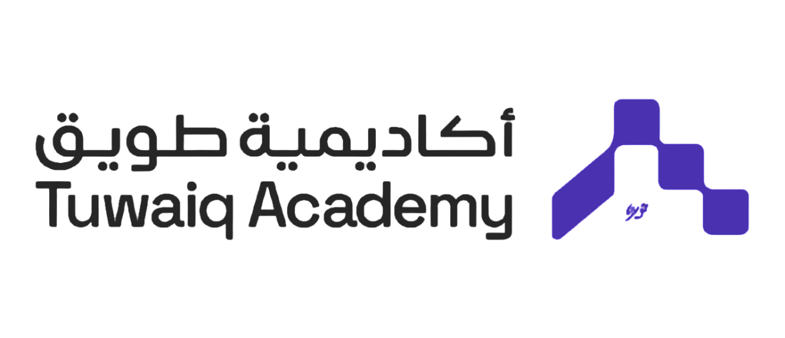

<!--
*** Thanks for checking out this README Template. If you have a suggestion that would
*** make this better, please fork the repo and create a pull request or simply open
*** an issue with the tag "enhancement".
*** Thanks again! Now go create something AMAZING! :D
-->

<!-- PROJECT SHIELDS -->
<!--
*** I'm using markdown "reference style" links for readability.
*** Reference links are enclosed in brackets [ ] instead of parentheses ( ).
*** See the bottom of this document for the declaration of the reference variables
*** for contributors-url, forks-url, etc. This is an optional, concise syntax you may use.
*** https://www.markdownguide.org/basic-syntax/#reference-style-links
-->
[![Contributors][contributors-shield]][contributors-url]
[![Forks][forks-shield]][forks-url]
[![Stargazers][stars-shield]][stars-url]
[![Issues][issues-shield]][issues-url]
[](https://repl.it/@AlexandruBangau/tic-toc-toe)

<!-- PROJECT LOGO -->
<br />
<p align="center">
  <a href="">

  </a>

<h3 align="center">Tic Tac Toe</h3>

  <p align="center">
    This project is requirement of the Web application development using Java Spring Boot bootcamps in Tuwaiq Academy!
    <br />
    <a href="https://github.com/salemALmotiry/Java-Bootcamp--Project-1"><strong>Explore the docs »</strong></a>
    <br />
    <br />
    <a href="">View Demo</a>
    ·
    <a href="https://github.com/salemALmotiry/Java-Bootcamp--Project-1/issues">Report Bug</a>
    ·
    <a href="https://github.com/salemALmotiry/Java-Bootcamp--Project-1/issues">Request Feature</a>
  </p>


<!-- TABLE OF CONTENTS -->
## Table of Contents

* [About the Project](#about-the-project)
    * [Built With](#built-with)
    * [Live Version](#live-version)
    * [Usage](#usage)
* [Game Rules](#game-rules)
* [Contributing](#contributing)
* [Acknowledgements](#acknowledgements)
* [License](#license)

<!-- ABOUT THE PROJECT -->
## About The Project

This is the JAVA Tic-Tac-Toe Project. In this project, users can play the classic Tic-Tac-Toe game on the command line, where two human players can compete, and the board is displayed between turns.

Additionally, players can enjoy Human vs. AI Mode, choosing between Easy or Hard difficulty levels to play against the computer.

Experience a new twist with INFINITE TIC-TAC-TOE! This mode brings fresh excitement to the game, allowing players to choose between head-to-head matches or competing against an adaptive AI that adjusts its difficulty based on the player's skill level. Say goodbye to endless draws and embrace a unique challenge every time!
[![Product Name Screen Shot][product-screenshot]](https://repl.it/@AlexandruBangau/tic-toc-toe)


### Built With
This project was built using these technologies.
* JAVA
* IntelliJ IDEA


<!-- ABOUT THE PROJECT -->
## Usage

To play this game you need to:
* have Java installed in your computer
* [download](https://github.com/SalemAlmotiry/Java-Bootcamp--Project-1/archive/master.zip) or clone this repo:
    - Clone with SSH:
  ```
    git@github.com:SalemALmotiry/Java-Bootcamp--Project-1
  ```
    - Clone with HTTPS
  ```
    https://github.com/SalemALmotiry/Java-Bootcamp--Project-1.git
  ```
* and execute src/main.java file using your terminal


## Game Rules

* This is a customized version of the original [tic-tac-toe](https://en.wikipedia.org/wiki/Tic-tac-toe) game. Tha basic rules remain unchanged, the INFINITE TIC-TAC-TOE mode added.

* The game is played on a 3 by 3 grid
  ```
    ___________________
    |  1  |  2  |  3  |
    |_________________|
    |  4  |  5  |  6  |
    |_________________|
    |  7  |  8  |  9  |
    |_________________| 
  ```

* The game settings menu presents players with options to customize their gaming experience in a Tic-Tac-Toe scenario.
  * One round and INFINITE TIC-TAC-TOE! mode against the AI selected.

    ```
      AI turn: "O"

          ___________________
          |  O  |  2  |  3  |
          |_________________|
          |  4  |  5  |  6  |
          |_________________|
          |  7  |  8  |  9  |
          |_________________|

      Player 1 turn: "X"

          ___________________
          |  O  |  2  |  3  |
          |_________________|
          |  4  |  X  |  6  |
          |_________________|
          |  7  |  8  |  9  |
          |_________________|
    ```
      * The first player to get 3 tokens in a row (up, down, across, or diagonally) wins.
    ```
        INFINITE TIC-TAC-TOE!

          O | 2 | 3    O | 2 | 3     O | O | 3     O | O | X     O | O | X     O | O | X     1 | O | X     X | O | X 
         -----------  -----------   -----------  -----------    -----------   -----------   -----------   -----------
          4 | 5 | 6    4 | X | 6     4 | X | 6     4 | X | 6     4 | X | 6     X | X | 6     X | X | O     X | 5 | O 
         -----------  -----------   -----------  -----------    -----------   -----------   -----------   -----------
          7 | 8 | 9    7 | 8 | 9     7 | 8 | 9     7 | 8 | 9     O | 8 | 9     O | 8 | 9     O | 8 | 9     O | 8 | 9 
    ```
      * Win game

        ```
            ___________________
            |  X  |  2  |  O  |
            |_________________|
            |  X  |  5  |  6  |
            |_________________|
            |  X  |  O  |  9  |
            |_________________|
        ```

<!-- LIVE VERSION -->
## Live version

You can see it working [here](https://tic-toc-toe.rammazzoti2000.repl.run/)


## :handshake: Contributing

Contributions, issues and feature requests are welcome!

Feel free to check the [issues page](https://github.com/salemALmotiry/Java-Bootcamp--Project-1/issues).

## Show your support

Give a :star: if you like this project!


<!-- ACKNOWLEDGEMENTS -->
## Acknowledgements
* [Java](https://www.java.com/en/)
* [IntelliJ IDEA](https://www.jetbrains.com/idea)
* [Replit](https://replit.com/)
* [tic-tac-toe](https://en.wikipedia.org/wiki/Tic-tac-toe)

<!-- MARKDOWN LINKS & IMAGES -->
<!-- https://www.markdownguide.org/basic-syntax/#reference-style-links -->
[contributors-shield]: https://img.shields.io/github/contributors/salemALmotiry/Java-Bootcamp--Project-1.svg?style=flat-square
[contributors-url]: https://github.com/salemALmotiry/Java-Bootcamp--Project-1/graphs/contributors
[forks-shield]: https://img.shields.io/github/forks/salemALmotiry/Java-Bootcamp--Project-1.svg?style=flat-square
[forks-url]: https://github.com/salemALmotiry/Java-Bootcamp--Project-1/network/members
[stars-shield]: https://img.shields.io/github/stars/salemALmotiry/Java-Bootcamp--Project-1.svg?style=flat-square
[stars-url]: https://github.com/salemALmotiry/Java-Bootcamp--Project-1/stargazers
[issues-shield]: https://img.shields.io/github/issues/salemALmotiry/Java-Bootcamp--Project-1.svg?style=flat-square
[issues-url]: salemALmotiry/Java-Bootcamp--Project-1/issues
[product-screenshot]: images/tic_tac_toc.png

## 📝 License

This project is [MIT](https://opensource.org/licenses/MIT) licensed.
